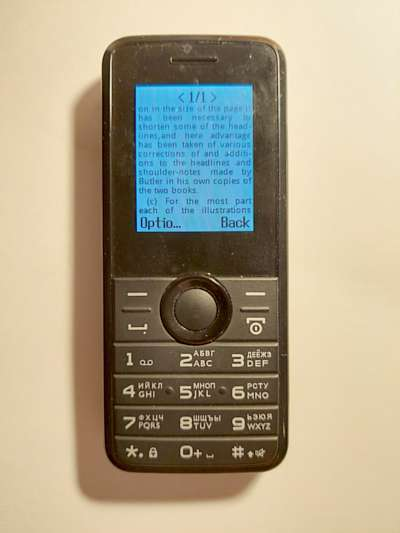

# Minibook

“Minibook” is text-to-image converter, written in C++.

## About the Project

“Minibook” allows one to read books on cellphones that do not have a text reader, but have a built-in image viewer.

“Minibook” hyphenates words and formats text beautifully. It's optimized primarily for Cyrillic and English texts.



## Dependencies

- [Anti-Grain Geometry library](https://github.com/ghaerr/agg-2.6)
- [FreeType library](http://freetype.org)
- [libpng library](http://www.libpng.org/pub/png/libpng.html) (optional)
- [Niels Lohmann's JSON library](https://github.com/nlohmann/json)
- [STB library](https://github.com/nothings/stb)
- [Droid Sans font](https://fonts.adobe.com/fonts/droid-sans)

## Building

### Windows

Prerequisites: 
- Windows SDK.
- Microsoft C++ Build Tools.
- CMake.

## Usage

1. Prepare text file (e.g. `book.txt`). It must be encoded in UTF-8 with BOM ([Byte Order Mark](https://en.wikipedia.org/wiki/Byte_order_mark))
2. Export default conversion parameters to JSON configuration file using the `--config` option:
```
Minibook --config=param.json 
```
3. Inspect JSON configuration and adjust parameters.
4. Convert the text to a set of images:
```
Minibook --config=param.json book.txt
```
5. Find the images in the `book` directory. You can directly specify the output directory name (e.g. `export`) with the  `--output` option:
```
Minibook --config=param.json --output=export book.txt
```
6. Connect cell phone to a computer via USB cable. Set connection mode to access the phone's filesystem. Copy directory with images to the phone's `Photos` folder.

### Notes

- Some phones only support JPEG images. Some others don't support nested folders in the `Photos` directory. So you may have to adjust the relevant configuration settings in the JSON file.
- “Minibook” uses the `DroidSans.ttf` font to render text by default. You should download it and place it next to the  `Minibook.exe` file.

## TODO

```
- [ ] P1: Fix TODOs in CMakeLists.txt.
- [ ] P1: Copy `libpng` binary files to binary output directory.
- [ ] P1: Use FSM in `UnicodeDecoder`.
- [ ] P1: Fix bugs in `LineUnwrapper` logic.
- [ ] P1: Fix wrong color components order.
- [ ] P2: Add more Doxygen-style comments.
- [ ] P2: Use STL to work with Unicode.
- [ ] P2: Remove `AGG` library inclusions from headers (using `Pimpl`?)
- [ ] P2: Replace non-printable characters with whitespaces in input stream.
- [ ] P3: Add detailed building instructions.
- [ ] P3: Support CR for line termination.
- [ ] P3: Enable and fix more compiler warnings.
- [ ] P3: Support for more platform and compilers.
- [ ] P3: Resolve TODOs in the code.
- [ ] P3: Add `clang-tidy` config.
```
